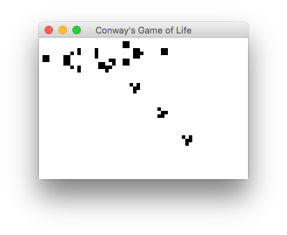

# Scala Game of Life kata [](https://travis-ci.org/amitayh/scala-game-of-life) [](https://codecov.io/gh/amitayh/scala-game-of-life)

Simple implementation of [Conway's Game of Life](https://en.wikipedia.org/wiki/Conway%27s_Game_of_Life) in Scala with TDD



## Running tests

```
$ mvn test
```
